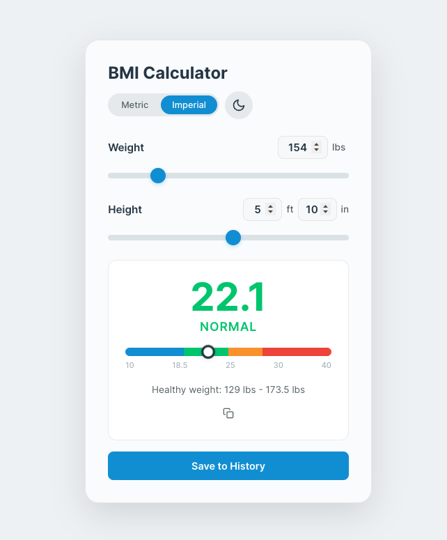

# BMI Calculator

Deployed Project: https://bmi-calculator-rho-gray.vercel.app/

A modern, responsive **BMI (Body Mass Index) Calculator** built with React and TypeScript. Adjust your weight and height using synced sliders and number inputs, get instant BMI results with a color-coded gauge, and track your history over time.

## Features

- **Real-time Calculation** — BMI updates instantly as you adjust weight and height
- **Metric & Imperial** — Toggle between kg/cm and lbs/ft-in with seamless conversion
- **BMI Gauge** — Color-coded gradient bar showing where your BMI falls
- **Healthy Weight Range** — Displays the healthy weight range for your height
- **Dark Mode** — Light/dark theme toggle, persisted across sessions
- **History Tracking** — Save BMI entries and view a mini chart of your last 10 results
- **Share** — Copy your BMI result to clipboard
- **Responsive** — Works on mobile, tablet, and desktop
- **Accessible** — ARIA labels, keyboard navigation, and screen reader support

## Tech Stack

- **React 18** with TypeScript
- **CSS Modules** with custom properties for theming
- **SVG** for the history chart (no chart library needed)
- **localStorage** for persisting theme, unit preference, and history
